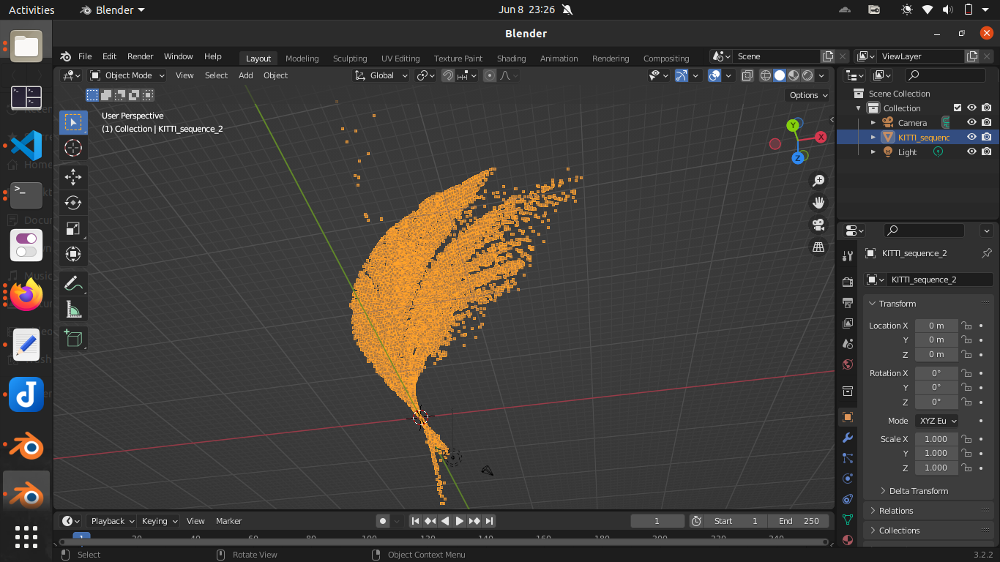

# Visual Depth estimamtion and Odometry

This repo is focused on monocular depth estimation for use in Visual Odometry.

A functionality was made to perform 3D reconstruction(pointcloud) from only 2D monocular images and feature-matching/triangulation. 

KITTI dataset was used.

Base reference project:[Visual Odometry](https://github.com/niconielsen32/VisualSLAM/)

3D output pointcloud for KITTI_sequence_1(curved trajectory):

